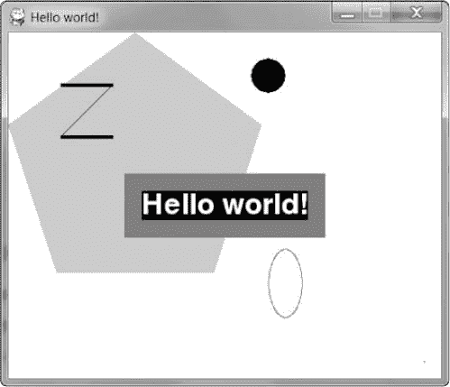
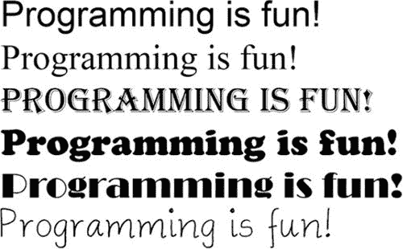
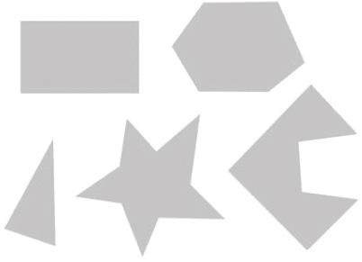

# 17 创建图形

> 原文：<https://inventwithpython.com/invent4thed/chapter17.html>


到目前为止，我们所有的游戏都只使用文本。文本作为输出显示在屏幕上，玩家输入文本作为输入。仅仅使用文本就能让编程变得简单易学。但是在这一章中，我们将使用 pygame 模块制作一些更令人兴奋的高级图形程序。

[第 17 章](#calibre_link-95)、[第 18 章](#calibre_link-96)、[第 19 章](#calibre_link-97)和[第 20 章](#calibre_link-98)将教你如何使用 pygame 制作带有图形、动画、鼠标输入和声音的游戏。在这几章中，我们将编写简单程序的源代码来演示 pygame 概念。然后在[第 21 章](#calibre_link-99)中，我们将把我们学到的所有概念放在一起创建一个游戏。

**本章涵盖的主题**

安装 pygame

pygame 中的颜色和字体

锯齿和反锯齿图形

属性

·pygame . font .、 pygame。表面、游戏。直角和游戏。像素数组〔T7〕数据类型

构造函数

pygame 的绘图功能

用于表面对象的 blit() 方法

事件

### **安装 pygame**

pygame 模块可以帮助开发者更容易地在你的电脑屏幕上绘制图形或为程序添加音乐，从而制作游戏。该模块不是 Python 自带的，但是和 Python 一样，可以免费下载。在*T5【https://www.nostarch.com/inventwithpython/】T6*下载 pygame ，按照你的操作系统的说明进行操作。

安装程序文件下载完成后，打开它并按照说明操作，直到 pygame 安装完成。要检查安装是否正确，请在交互式 shell 中输入以下内容:

```py
>>> import pygame
```

如果按下<small class="calibre11">回车</small>后没有任何反应，那么你就知道 pygame 已经成功安装。如果错误导入错误:没有名为 pygame 的模块出现，尝试再次安装 pygame (并确保您正确键入了导入 pygame )。

**注**

当你写 Python 程序时，不要把你的文件保存为 pygame.py *。如果您这样做了，那么*import py game*行将导入您的文件，而不是真正的*py game*模块，并且您的所有代码都将不起作用。*

### **py game 中的 Hello World**

首先，我们将制作一个新的 pygame Hello World 程序，就像你在本书开头创建的那个程序一样。这一次，您将使用 pygame 制作“Hello world！”出现在图形窗口中，而不是作为文本。在本章中，我们将仅仅使用 pygame 在窗口上绘制一些形状和线条，但是你将很快使用这些技能来制作你的第一个动画游戏。

py game模块和交互 shell 配合不好，只能在文件编辑器里用 pygame 写程序；不能通过交互 shell 一次发送一个指令。

另外， pygame 程序不使用 print() 或 input() 函数。没有文本输入或输出。相反， pygame 通过在单独的窗口中绘制图形和文本来显示输出。对 pygame 的输入通过*事件*来自键盘和鼠标，这在第 270 页的[事件和游戏循环](#calibre_link-100)中有所介绍。

### **pygame Hello World 的试运行**

当你运行图形化的 Hello World 程序时，你应该会看到一个类似于图 17-1 的新窗口。



*图 17-1:*`pygame`*你好世界节目*

使用窗口而不是控制台的好处是文本可以出现在窗口中的任何地方，而不仅仅是在您打印的前一个文本之后。文本也可以是任何颜色和大小。窗户就像一块画布，你可以在上面画任何你喜欢的东西。

### **pygame Hello World 的源代码**

在文件编辑器中输入以下代码，保存为 *pygameHelloWorld.py* 。如果你在输入这段代码后出现错误，用 https://www.nostarch.com/inventwithpython#diffT3*T5【在线比较工具】将你输入的代码与书中的代码进行比较。*


*游戏 HelloWorld.py*

```py
 1\. import pygame, sys
 2\. from pygame.locals import *
 3.
 4\. # Set up pygame.
 5\. pygame.init()
 6.
 7\. # Set up the window.
 8\. windowSurface = pygame.display.set_mode((500, 400), 0, 32)
 9\. pygame.display.set_caption('Hello world!')
10.
11\. # Set up the colors.
12\. BLACK = (0, 0, 0)
13\. WHITE = (255, 255, 255)
14\. RED = (255, 0, 0)
15\. GREEN = (0, 255, 0)
16\. BLUE = (0, 0, 255)
17.
18\. # Set up the fonts.
19\. basicFont = pygame.font.SysFont(None, 48)
20.
21\. # Set up the text.
22\. text = basicFont.render('Hello world!', True, WHITE, BLUE)
23\. textRect = text.get_rect()
24\. textRect.centerx = windowSurface.get_rect().centerx
25\. textRect.centery = windowSurface.get_rect().centery
26.
27\. # Draw the white background onto the surface.
28\. windowSurface.fill(WHITE)
29.
30\. # Draw a green polygon onto the surface.
31\. pygame.draw.polygon(windowSurface, GREEN, ((146, 0), (291, 106),
      (236, 277), (56, 277), (0, 106)))
32.
33\. # Draw some blue lines onto the surface.
34\. pygame.draw.line(windowSurface, BLUE, (60, 60), (120, 60), 4)
35\. pygame.draw.line(windowSurface, BLUE, (120, 60), (60, 120))
36\. pygame.draw.line(windowSurface, BLUE, (60, 120), (120, 120), 4)
37.
38\. # Draw a blue circle onto the surface.
39\. pygame.draw.circle(windowSurface, BLUE, (300, 50), 20, 0)
40.
41\. # Draw a red ellipse onto the surface.
42\. pygame.draw.ellipse(windowSurface, RED, (300, 250, 40, 80), 1)
43.
44\. # Draw the text's background rectangle onto the surface.
45\. pygame.draw.rect(windowSurface, RED, (textRect.left - 20,
      textRect.top - 20, textRect.width + 40, textRect.height + 40))
46.
47\. # Get a pixel array of the surface.
48\. pixArray = pygame.PixelArray(windowSurface)
49\. pixArray[480][380] = BLACK
50\. del pixArray
51.
52\. # Draw the text onto the surface.
53\. windowSurface.blit(text, textRect)
54.
55\. # Draw the window onto the screen.
56\. pygame.display.update()
57.
58\. # Run the game loop.
59\. while True:
60.     for event in pygame.event.get():
61.         if event.type == QUIT:
62.             pygame.quit()
63.             sys.exit()
```

### **导入 pygame 模块**

让我们仔细检查每一行代码，看看它们是做什么的。

首先，您需要导入 pygame 模块，这样您就可以调用它的函数。通过用逗号分隔模块名称，可以在同一行中导入多个模块。第 1 行导入了 pygame 和 sys 模块:

```py
1\. import pygame, sys
2\. from pygame.locals import *
```

第二行导入了 pygame.locals 模块。这个模块包含许多常量变量，你将在 pygame 中使用，比如退出，它帮助你退出程序，还有 K_ESCAPE ，它代表 <small class="calibre11">ESC</small> 键。

第 2 行还让您可以使用 pygames.locals 模块，而不必在每个方法、常量或您从模块中调用的任何东西前面键入 pygames.locals. 。

如果你的程序中有来自 sys import * 的，而不是 import sys ，你可以在你的代码中调用 exit() 而不是 sys.exit() 。但是大多数时候最好使用完整的函数名，这样你就知道函数在哪个模块中。

### **初始化 pygame**

所有 pygame 程序必须在导入 pygame 模块之后，调用任何其他 pygame 函数之前，调用 pygame.init() :

```py
4\. # Set up pygame.
5\. pygame.init()
```

这将初始化 pygame 以便它可以使用。你不需要知道 init() 是做什么的；你只需要记得在使用任何其他 pygame 功能之前调用它。

### **设置 pygame 窗口**

第 8 行通过调用 pygame.display 模块中的 set_mode() 方法创建一个*图形用户界面(GUI)* 窗口。(显示模块是 pygame 模块内部的一个模块。甚至 pygame 模块也有自己的模块！)

```py
7\. # Set up the window.
8\. windowSurface = pygame.display.set_mode((500, 400), 0, 32)
9\. pygame.display.set_caption('Hello world!')
```

这些方法帮助建立一个窗口让 pygame 运行。与声纳寻宝游戏一样，窗口使用坐标系，但窗口的坐标系是以像素为单位组织的。

一个像素是你电脑屏幕上最小的点。屏幕上的单个像素可以以任何颜色发光。你屏幕上的所有像素一起工作来显示你所看到的图片。我们将使用一个*元组*创建一个 500 像素宽、400 像素高的窗口。

#### ***元组***

元组值类似于列表，除了它们使用圆括号而不是方括号。还有，和字符串一样，元组也是不能修改的。例如，在交互式 shell 中输入以下内容:

```py
   >>> spam = ('Life', 'Universe', 'Everything', 42)
➊ >>> spam[0]
   'Life'
   >>> spam[3]
   42
➋ >>> spam[1:3]
   ('Universe', 'Everything')
➌ >>> spam[3] = 'Hello'
➍ Traceback (most recent call last):
     File "<stdin>", line 1, in <module>
   TypeError: 'tuple' object does not support item assignment
```

正如您从示例中看到的，如果您只想获得元组 ➊ 中的一项或一系列项 ➋ ，您仍然可以像列表一样使用方括号。然而，如果你试图将索引 3 处的项目改为字符串‘hello’➌，Python 将会抛出错误 ➍ 。

我们将使用元组来设置 pygame 窗口。py game . display . set _ mode()方法有三个参数。第一个是由两个整数组成的元组，以像素为单位表示窗口的宽度和高度。要设置一个 500×400 像素的窗口，可以使用元组 (500，400) 作为 set_mode() 的第一个参数。第二个和第三个参数是高级选项，超出了本书的范围。分别为它们通过 0 和 32 即可。

#### ***表面物体***

函数的作用是:返回一个游戏。表面物体(简称表面物体)。 *Object* 只是拥有方法的数据类型的值的另一个名字。比如，字符串在 Python 中是对象，因为它们有数据(字符串本身)和方法(比如 lower() 和 split() )。表面对象代表窗口。

变量存储对对象的引用，就像它们存储对列表和字典的引用一样(参见[第 132](#calibre_link-104) 页的"[列表引用](#calibre_link-103))。

第 9 行的 set_caption() 方法只是将窗口标题设置为‘Hello World！’。标题在窗口的左上方。

### **设置颜色变量**

像素的光有三种主要颜色:红色、绿色和蓝色。通过组合不同数量的这三种颜色(这就是你的电脑屏幕所做的)，你可以形成任何其他颜色。在 pygame 中，颜色由三个整数的元组表示。这些被称为 *RGB 颜色*值，我们将在我们的程序中使用它们来给像素分配颜色。由于我们不希望每次在程序中使用特定颜色时都重写三个数字的元组，所以我们将创建常量来保存以元组所代表的颜色命名的元组:

```py
11\. # Set up the colors.
12\. BLACK = (0, 0, 0)
13\. WHITE = (255, 255, 255)
14\. RED = (255, 0, 0)
15\. GREEN = (0, 255, 0)
16\. BLUE = (0, 0, 255)
```

元组中的第一个值决定了颜色中有多少红色。值 0 表示颜色中没有红色，值 255 表示颜色中有最大量的红色。第二个值代表绿色，第三个值代表蓝色。这三个整数构成了一个 RGB 元组。

例如，元组 (0，0，0) 没有红色、绿色或蓝色。最终的颜色是全黑的，如第 12 行所示。元组 (255，255，255) 具有最大量的红色、绿色和蓝色，产生白色，如第 13 行所示。

我们还将使用红色、绿色和蓝色，它们被分配在第 14 到 16 行。元组 (255，0，0) 表示红色的最大量，但没有绿色或蓝色，因此结果颜色是红色。同样， (0，255，0) 是绿色， (0，0，255) 是蓝色。

你可以混合红色、绿色和蓝色的数量来获得任何颜色的阴影。[表 17-1](#calibre_link-105) 有一些常见的颜色及其 RGB 值。网页为不同的颜色列出了几个更多的元组值。

**表 17-1:** 颜色及其 RGB 值

| **颜色** | **RGB 值** |
| --- | --- |
| 黑色 | (0, 0, 0) |
| 蓝色 | (0, 0, 255) |
| 灰色的 | (128, 128, 128) |
| 格林（姓氏）；绿色的 | (0, 128, 0) |
| 石灰 | (0, 255, 0) |
| 紫色 | (128, 0, 128) |
| 红色 | (255, 0, 0) |
| 蓝绿色 | (0, 128, 128) |
| 白色的 | (255, 255, 255) |
| 黄色 | (255, 255, 0) |

我们将只使用我们已经定义的五种颜色，但是在你的程序中，你可以使用这些颜色中的任何一种，甚至可以组成不同的颜色。

### **在 pygame 窗口上写文字**

在窗口上书写文本与仅仅使用 print() 略有不同，正如我们在基于文本的游戏中所做的那样。为了在窗口上写文本，我们需要先做一些设置。

#### ***使用字体来样式化文本***

字体是以单一样式绘制的一整套字母、数字、符号和字符。我们会在任何需要在 pygame 窗口上打印文本的时候使用字体。[图 17-2](#calibre_link-106) 显示了用不同字体打印的同一个句子。



*图 17-2:不同字体的例子*

在我们早期的游戏中，我们只告诉 Python 打印文本。用于显示该文本的颜色、大小和字体完全由您的操作系统决定。Python 程序无法更改字体。然而， pygame 可以在你的电脑上绘制任何字体的文本。

第 19 行通过调用带有两个参数的 pygame.font.SysFont() 函数创建了一个 pygame.font.Font 对象(简称为 Font 对象):

```py
18\. # Set up the fonts.
19\. basicFont = pygame.font.SysFont(None, 48)
```

第一个参数是字体的名称，但是我们将传递 None 值来使用默认的系统字体。第二个参数是字体的大小(用称为*点*的单位来度量)。我们将画出‘你好，世界！’窗口上默认字体为 48 点。为文本生成字母图像，如“Hello world！”叫做*渲染*。

#### ***渲染一个字体对象***

你存储在 basicFont 变量中的字体对象有一个名为 render() 的方法。该方法将返回一个表面对象，上面绘制有文本。 render() 的第一个参数是要绘制的文本的字符串。第二个参数是一个布尔值，表示是否对字体进行反锯齿处理。消除锯齿会稍微模糊文本，使其看起来更平滑。[图 17-3](#calibre_link-107) 显示了有无反走样的线条。


*图 17-3:锯齿线和反锯齿线的放大图*

在第 22 行，我们传递 True 来使用抗锯齿:

```py
21\. # Set up the text.
22\. text = basicFont.render('Hello world!', True, WHITE, BLUE)
```

第 22 行的第三和第四个参数都是 RGB 元组。第三个参数是文本呈现的颜色(本例中为白色)，第四个参数是文本背后的背景颜色(蓝色)。我们将表面对象分配给变量文本。

一旦我们设置了字体对象，我们需要把它放在窗口上的一个位置。

#### ***用 Rect 属性设置文本位置***

pygame 游戏。Rect 数据类型(简称 Rect )表示一定大小和位置的矩形区域。这是我们用来设置对象在窗口上的位置。

为了创建一个新的 Rect 对象，您调用函数 pygame。Rect() 。注意这个游戏。Rect() 函数与 pygame 同名。Rect 数据类型。与其数据类型同名并创建其数据类型的对象或值的函数称为*构造函数*。 pygame 的参数。Rect() 函数是左上角的 x 和 y 坐标的整数，后跟宽度和高度，都以像素为单位。带参数的函数名如下: pygame。矩形(左侧、顶部、宽度、高度 ) 。

当我们创建字体对象时，已经为它创建了一个矩形对象，所以我们现在需要做的就是检索它。为此，我们对文本使用 get_rect() 方法，并将 Rect 分配给 textRect :

```py
23\. textRect = text.get_rect()
24\. textRect.centerx = windowSurface.get_rect().centerx
25\. textRect.centery = windowSurface.get_rect().centery
```

正如方法是与对象相关联的函数一样，*属性*是与对象相关联的变量。 Rect 数据类型有许多描述它们所代表的矩形的属性。为了设置 textRect 在窗口上的位置，我们需要将它的中心 x 和 y 值分配给窗口上的像素坐标。由于每个 Rect 对象已经具有存储 Rect 中心的 x 和 y 坐标的属性，分别称为 centerx 和 centery ，我们需要做的就是分配这些坐标值。

我们想把 textRect 放在窗口的中央，所以我们需要得到 windowSurface Rect ，得到它的centex和 centery 属性，然后把它们赋给 textRect 的 centerx 和 centery 属性。我们在第 24 行和第 25 行这样做。

我们可以使用许多其他的 Rect 属性。[表 17-2](#calibre_link-108) 是一个名为 myRect 的 Rect 对象的属性列表。

**表 17-2:** Rect 属性

| pygame.直肠 **属性** | **描述** |
| --- | --- |
| myRect.left | 矩形左侧的 x 坐标的整数值 |
| myRect.right | 矩形右侧的 x 坐标的整数值 |
| 有毒。顶部 | 矩形顶边的 y 坐标的整数值 |
| myRect.bottom | 矩形底边的 y 坐标的整数值 |
| 【myret . centerx】 | 矩形中心的 x 坐标的整数值 |
| myRect.centery | 矩形中心的 y 坐标的整数值 |
| my ect . width的宽度 | 矩形宽度的整数值 |
| 米正确高度 | 矩形高度的整数值 |
| 毒药。你的 | 两个整数的元组:(宽度，高度) |
| 中毒性。左上方 | 两个整数的元组:(左上) |
| 小米。topright | 两个整数的元组:(右上) |
| 小米。巴特勒左 | 两个整数的元组:(左，下) |
| 小米。巴特勒右 | 两个整数的元组:(右下) |
| 中药水。中左 | 两个整数的元组:(左，中) |
| myRect.midright | 两个整数的元组:(右中) |
| 有毒。中央 | 两个整数的元组:(centex，top) |
| 小米。midbottom | 两个整数的元组:(centex，bottom) |

关于 Rect 对象的伟大之处在于，如果你修改这些属性中的任何一个，所有其他属性也会自动修改它们自己。例如，如果您创建一个宽 20 像素、高 20 像素的 Rect 对象，并且左上角的坐标为 (30，40) ，那么右边的 x 坐标将自动设置为 50 (因为 20 + 30 = 50)。

或者如果你改为用 myRect.left = 100 这一行来更改 left 属性，那么 pygame 会自动将 right 属性更改为 120 (因为 20 + 100 = 120)。该 Rect 对象的所有其他属性也被更新。

**关于方法、模块和数据类型的更多信息**

在 pygame 模块内部是字体和表面模块，在*内部那些*模块是字体和表面数据类型。pygame 的程序员用小写字母开始模块，用大写字母开始数据类型，以便更容易区分数据类型和模块。

注意，字体对象(存储在第 23 行的文本变量中)和表面对象(存储在第 24 行的窗口表面变量中)都有一个名为 get_rect() 的方法。从技术上来说，这是两种不同的方法，但是 pygame 的程序员给了它们相同的名字，因为它们都做同样的事情:返回代表 Font 或 Surface 对象的大小和位置的 Rect 对象。

### **用颜色填充表面对象**

对于我们的程序，我们想用白色填充存储在 windowSurface 中的整个表面。 fill() 函数将用你作为参数传递的颜色完全覆盖表面。(记住，白色变量在第 13 行被设置为值 (255，255，255) 。)

```py
27\. # Draw the white background onto the surface.
28\. windowSurface.fill(WHITE)
```

请注意，在 pygame 中，当您调用 fill() 方法或任何其他绘图函数时，屏幕上的窗口不会改变。相反，这些将改变表面对象，您必须使用 pygame.display.update() 函数将新的表面对象呈现到屏幕上，以查看变化。

这是因为修改电脑内存中的面对象比修改屏幕上的图像要快得多。在所有的绘图功能都被绘制到表面对象之后，在屏幕上绘制一次会更有效率。

### **pygame 的绘图功能**

到目前为止，我们已经学会了如何用颜色填充一个 pygame 窗口并添加文本，但是 pygame 也有让你绘制形状和线条的功能。每个形状都有自己的功能，您可以将这些形状组合成不同的图片，用于您的图形游戏。

#### ***绘制多边形***

pygame.draw.polygon() 函数可以画出你给它的任何多边形形状。一个*多边形*是一个多边形，它的边是直线。圆和椭圆不是多边形，所以我们需要对这些形状使用不同的函数。

该函数的参数按顺序如下:

1.  要在其上绘制多边形的表面对象。

2.  多边形的颜色。

3.  一个元组元组，表示要按顺序绘制的点的 x 和 y 坐标。最后一个元组将自动连接到第一个元组以完成形状。

4.  或者，多边形线宽度的整数。没有这个，多边形将被填充。

在第 31 行，我们在白色的表面上画了一个绿色的多边形。

```py
30\. # Draw a green polygon onto the surface.
31\. pygame.draw.polygon(windowSurface, GREEN, ((146, 0), (291, 106),
      (236, 277), (56, 277), (0, 106)))
```

我们希望我们的多边形被填充，所以我们没有给出线宽的最后一个可选整数。图 17-4 显示了一些多边形的例子。



*图 17-4:多边形示例*

#### ***画一条线***

pygame.draw.line() 函数只是从屏幕上的一点画一条线到另一点。 pygame.draw.line() 的参数依次如下:

1.  要在其上画线的表面对象。

2.  线条的颜色。

3.  线一端的 x 和 y 坐标的两个整数的元组。

4.  线另一端的 x 和 y 坐标的两个整数的元组。

5.  可选，以像素为单位的线条宽度的整数。

在第 34 到 36 行，我们调用了 pygame.draw.line() 三次:

```py
33\. # Draw some blue lines onto the surface.
34\. pygame.draw.line(windowSurface, BLUE, (60, 60), (120, 60), 4)
35\. pygame.draw.line(windowSurface, BLUE, (120, 60), (60, 120))
36\. pygame.draw.line(windowSurface, BLUE, (60, 120), (120, 120), 4)
```

如果不指定宽度参数，将采用默认值 1 。在第 34 行和第 36 行，我们为宽度传递了 4 ，所以这两行将是 4 像素厚。第 34、35 和 36 行上的三个 pygame.draw.line() 调用在表面对象上绘制蓝色 Z。

#### ***画圆***

pygame.draw.circle() 函数在表面物体上画圆。其参数按顺序如下:

1.  要在其上绘制圆的表面对象。

2.  圆的颜色。

3.  圆心的 x 和 y 坐标的两个整数的元组。

4.  圆的半径(即大小)的整数。

5.  或者，线条宽度的整数。宽度为 0 表示圆将被填充。

第 39 行在表面物体上画了一个蓝色圆圈:

```py
38\. # Draw a blue circle onto the surface.
39\. pygame.draw.circle(windowSurface, BLUE, (300, 50), 20, 0)
```

这个圆的中心位于 x 坐标 300 处，y 坐标 50 处。圆的半径为 20 像素，用蓝色填充。

#### ***画椭圆***

pygame.draw.ellipse() 函数类似于 pygame.draw.circle() 函数，但它绘制的是一个椭圆，就像一个压扁的圆。 pygame.draw.ellipse() 函数的参数依次如下:

1.  要在其上绘制椭圆的表面对象。

2.  椭圆的颜色。

3.  一个由四个整数组成的元组，用于表示椭圆的 Rect 对象的左上角以及椭圆的宽度和高度。

4.  或者，线条宽度的整数。宽度为 0 意味着椭圆将被填充。

第 42 行在表面对象上画了一个红色椭圆:

```py
41\. # Draw a red ellipse onto the surface.
42\. pygame.draw.ellipse(windowSurface, RED, (300, 250, 40, 80), 1)
```

椭圆的左上角位于 x 坐标 300 和 y 坐标 250 处。该形状宽 40 像素，高 80 像素。椭圆的轮廓宽 1 像素。

#### ***画矩形***

pygame.draw.rect() 函数将绘制一个矩形。 pygame.draw.rect() 函数的参数依次如下:

1.  要在其上绘制矩形的表面对象。

2.  矩形的颜色。 
3.  一个由四个整数组成的元组，表示左上角的 x 和 y 坐标以及矩形的宽度和高度。代替第三个参数的四个整数的元组，您也可以传递一个 Rect 对象。

在 Hello World 程序中，我们希望我们绘制的矩形在文本的所有边周围 20 像素处可见。记住，在第 23 行我们创建了一个 textRect 来包含我们的文本。在第 45 行，我们将矩形的左顶点和上顶点设置为 textRect 的左顶点和上顶点减去 20(我们减去是因为坐标随着你向左上方移动而减少):

```py
44\. # Draw the text's background rectangle onto the surface.
45\. pygame.draw.rect(windowSurface, RED, (textRect.left - 20,
      textRect.top - 20, textRect.width + 40, textRect.height + 40))
```

矩形的宽度和高度等于 textRect 的宽度和高度加上 40。我们使用 40，而不是 20，因为左边和顶部被向后移动了 20 个像素，所以你需要弥补这个空间。

#### ***着色像素***

第 48 行创建了一个 pygame。PixelArray 对象(简称为 PixelArray 对象)。 PixelArray 对象是一个颜色元组列表的列表，表示您传递给它的表面对象。

PixelArray 对象为您提供了高水平的每像素控制，因此如果您需要在屏幕上绘制非常详细或定制的图像，而不仅仅是大的形状，它是一个不错的选择。

我们将使用像素阵列给窗口表面上的一个像素着色为黑色。当你运行 pygame Hello World 时，你可以在窗口的右下角看到这个像素。

线 48 通过窗户表面到达 pygame。PixelArray() 调用，因此将第 49 行上的黑色分配给pixel array[480][380]将使坐标 (480，380) 处的像素变为黑色:

```py
47\. # Get a pixel array of the surface.
48\. pixArray = pygame.PixelArray(windowSurface)
49\. pixArray[480][380] = BLACK
```

pygame 模块会根据这个变化自动修改窗口面对象。

PixelArray 对象中的第一个索引用于 x 坐标。第二个索引用于 y 坐标。像素阵列对象使得将表面对象上的单个像素设置为特定颜色变得容易。

每次你从一个表面对象创建一个像素阵列对象，那个表面对象就被锁定。这意味着不能在那个表面对象上进行 blit() 方法调用(如下所述)。要解锁表面对象，必须用 del 操作符删除像素数组对象:

```py
50\. del pixArray
```

如果你忘记这么做，你会得到一个错误信息，说 pygame.error:在 blit 过程中不能锁定表面。

### **表面物体的 blit()方法**

blit() 方法将一个表面对象的内容绘制到另一个表面对象上。由 render() 方法创建的所有文本对象都存在于它们自己的表面对象上。 pygame 绘制方法都可以指定在表面对象上绘制形状或线条，但是我们的文本被存储到文本变量中，而不是绘制到窗口表面上。为了在我们希望它出现的表面上绘制文本，我们必须使用 blit() 方法:

```py
52\. # Draw the text onto the surface.
53\. windowSurface.blit(text, textRect)
```

第 53 行画出了‘你好，世界！’将文本变量(在第 22 行定义)中的表面对象放到存储在窗口表面变量中的表面对象上。

blit() 的第二个参数指定应该在窗口表面的什么地方绘制文本表面。第 23 行调用 text.get_rect() 得到的 Rect 对象被传递给这个参数。

### **将表面对象绘制到屏幕上**

因为在 pygame 中，直到函数 pygame.display.update() 被调用之前，实际上没有任何东西被绘制到屏幕上，所以我们在第 56 行调用它来显示我们更新的表面对象:

```py
55\. # Draw the window onto the screen.
56\. pygame.display.update()
```

为了节省内存，您不希望在每个绘图功能后都更新到屏幕上；相反，您希望在调用了所有绘图函数之后，只更新一次屏幕。

### **事件和游戏循环**

在我们以前的游戏中，所有的程序都会立即打印所有内容，直到它们到达一个 input() 函数调用。在这一点上，程序会停下来，等待用户输入一些东西，然后按下<small class="calibre11">回车</small>。但是 pygame 程序一直在通过一个*游戏循环*运行，每秒钟执行循环中的每一行代码大约 100 次。

游戏循环不断检查新事件，更新窗口状态，并在屏幕上绘制窗口。*事件*由 pygame 生成，每当用户按下一个键，点击或移动鼠标，或者执行一些程序识别的其他动作，这些动作应该使游戏中发生一些事情。一个事件是一个 pygame.event.Event 数据类型的对象。

第 59 行是游戏循环的开始:

```py
58\. # Run the game loop.
59\. while True:
```

将 while 语句的条件设置为真，以便它永远循环。只有当一个事件导致程序终止时，循环才会退出。

#### ***获取事件对象***

函数 pygame.event.get() 检查自从上次调用 pygame.event.get() 以来生成的任何新的 pygame.event.Event 对象(简称为 Event 对象)。这些事件作为 Event 对象的列表返回，然后程序将执行这些对象以执行一些动作来响应事件。所有的事件对象都有一个名为类型的属性，它告诉我们事件的类型。在本章中，我们只需要使用 QUIT 事件类型，它告诉我们用户何时退出程序:

```py
60.     for event in pygame.event.get():
61.         if event.type == QUIT:
```

在第 60 行，我们使用一个 for 循环来迭代由 pygame.event.get() 返回的列表中的每个事件对象。如果事件的 type 属性等于常量变量QUIT——它位于我们在程序开始时导入的 pygame.locals 模块中——那么您知道已经生成了 QUIT 事件。

当用户关闭程序窗口或者当计算机关机并试图终止所有正在运行的程序时， pygame 模块产生 QUIT 事件。接下来，我们将告诉程序当它检测到退出事件时该做什么。

#### ***退出程序***

如果 QUIT 事件已经生成，程序将同时调用 pygame.quit() 和 sys.exit() :

```py
62.             pygame.quit()
63.             sys.exit()
```

函数 pygame.quit() 与 init() 有点相反。你需要在退出程序前调用它。如果你忘记了，你可能会导致 IDLE 在你的程序结束后挂起。第 62 和 63 行退出 pygame 并结束程序。

### **总结**

在这一章中，我们讨论了许多新的主题，这些主题将会让我们比以前的游戏做得更多。不仅仅是通过调用 print() 和 input() 来处理文本，一个 pygame 程序有一个空白窗口——由py game . display . set _ mode()创建——我们可以在上面绘图。pygame 的绘图功能可以让你在这个窗口中用多种颜色绘制形状。您也可以创建各种大小的文本。这些绘图可以在窗口内的任意 x 和 y 坐标上，不像由 print() 创建的文本。

即使代码更复杂，pygame 程序也比文字游戏有趣得多。接下来，让我们学习如何用动画图形创建游戏。